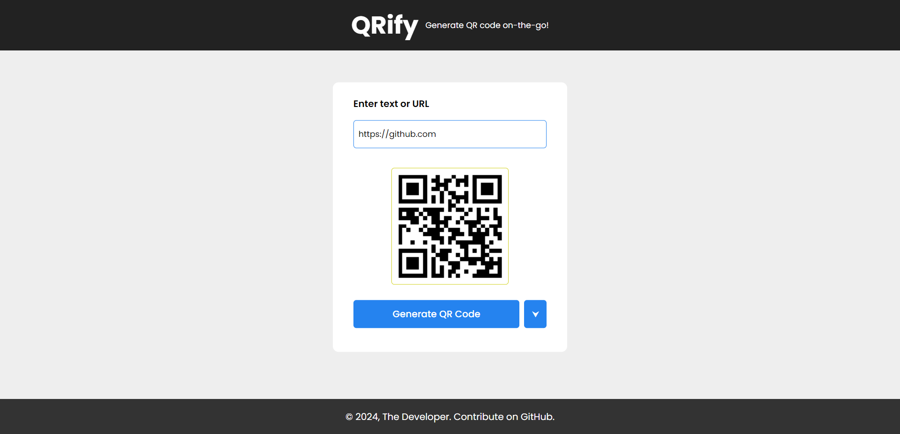

# QRify

A QR code generator web application built using HTML, CSS and JavaScript.

Your on-the-go QR Code genrator web application built with HTML, CSS, and JavaScript. Features include creating QR code and downloading the image.

### Technologies Used

- HTML (for creating the structure of web pages)
- CSS (for styling)
- JavaScript (for adding functionality)

### Usage

- Generate QR Code.
- Down the image.

### To Do:

- [ ] Save History of Generated QR Codes
- [ ] Dark Mode
- [ ] Share QR Code
- [ ] Customization (color, size, shape)

### Getting Started

- Clone the repository (`git clone <repository_url>`).
- Run in your browser.
